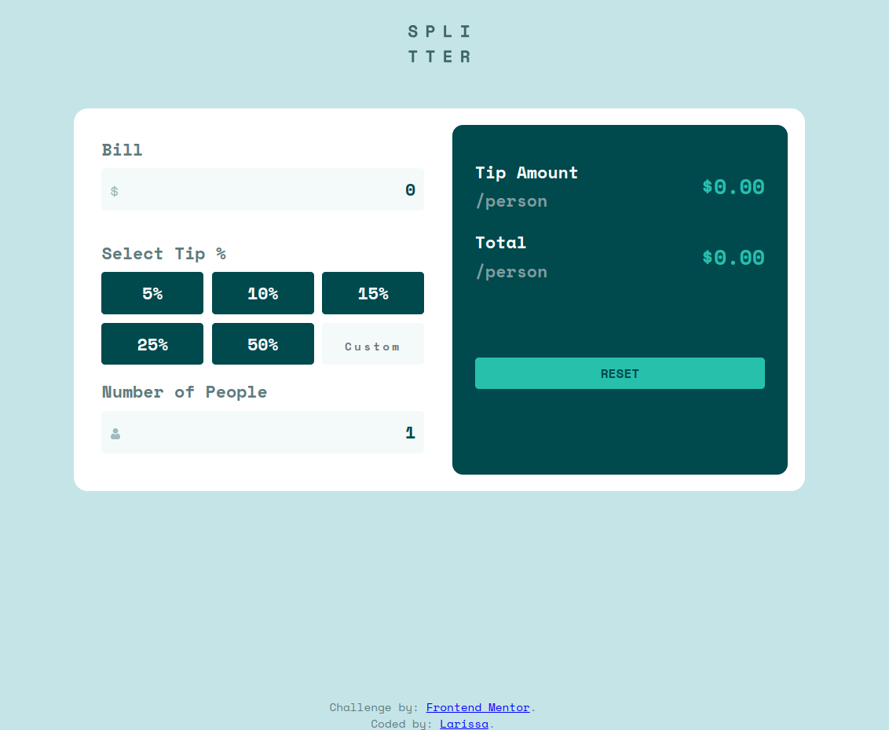

# Frontend Mentor - Tip calculator app solution

Esta é uma solução para o  [Tip calculator app challenge on Frontend Mentor](https://www.frontendmentor.io/challenges/tip-calculator-app-ugJNGbJUX). Os desafios do Frontend Mentor ajudam você a melhorar suas habilidades de codificação criando projetos realistas.

## Índice

- [Visão geral](#visão geral)
   - [O desafio](#o-desafio)
   - [Captura de tela](#captura de tela)
   - [Links](#links)
- [Meu processo](#meu-processo)
   - [Construído com](#construído com)

## Visão geral

### O desafio

Os usuários devem ser capazes de:

- Ver o layout ideal para o aplicativo, dependendo do tamanho da tela do dispositivo
- Veja os `hover states` para todos os elementos interativos na página
- Calcular a gorjeta correta e o custo total da conta por pessoa

### Captura de tela

### Links

- URL da solução: [tip-calculator-app](https://github.com/larissamaehara/tip-calculator-app)
- URL do site ao vivo: [tip-calculator-app](https://your-live-site-url.com)

## Meu processo

### Construído com

- Marcação HTML5 semântica
- Propriedades personalizadas CSS
- Flexbox
- Grade CSS
- Media Query
